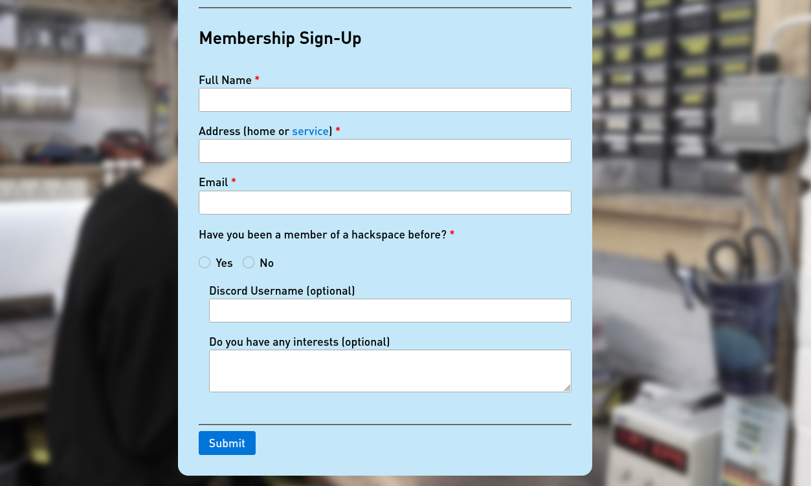

# Membership Form

*not currently used*

To install:

1. connect to `iHOST` PC inside the space (i.e., with `ssh`)
2. move files in this repository to that server (i.e., with `scp`)

This form "simply" sends an email with the details to the trustee email. The email manager is then responsible for furthering the information into the membership management system.
